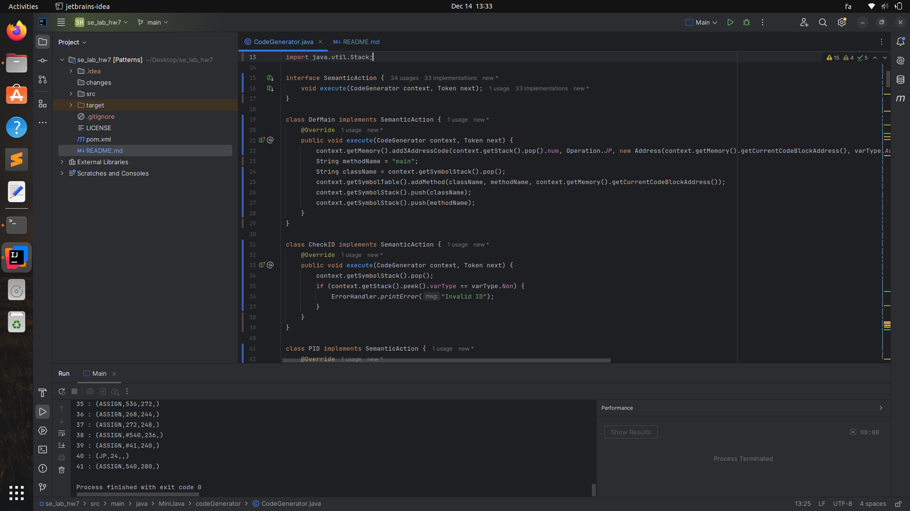
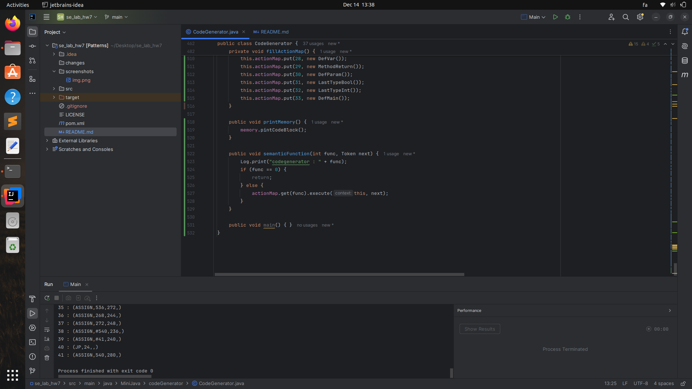
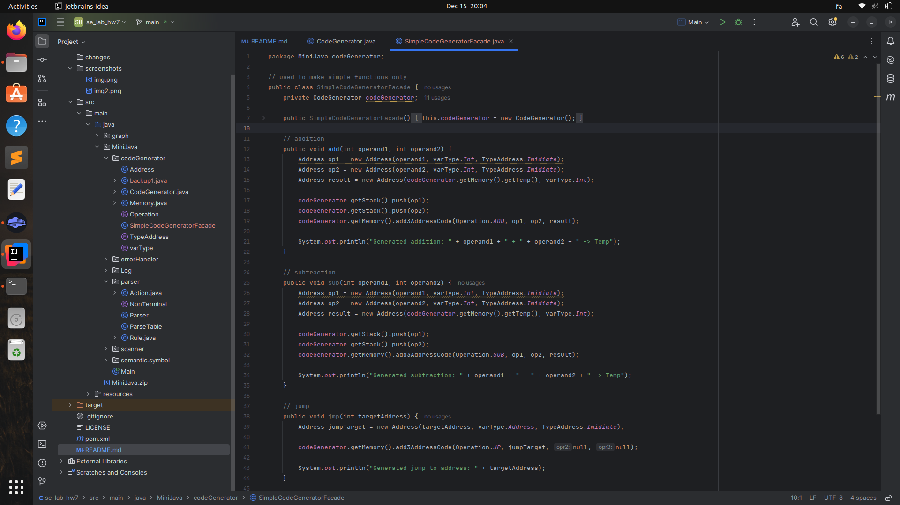
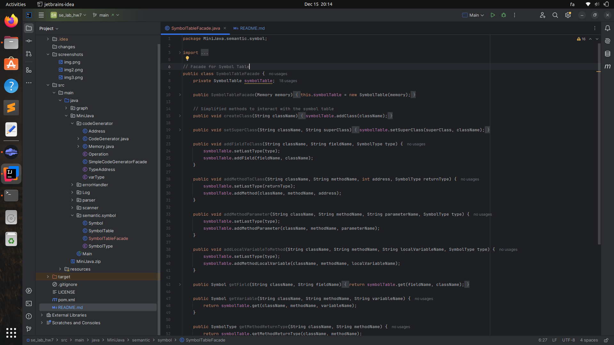
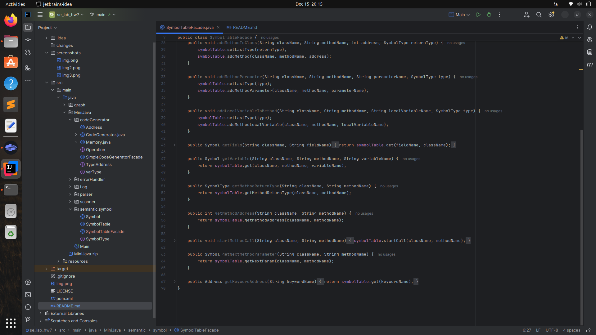
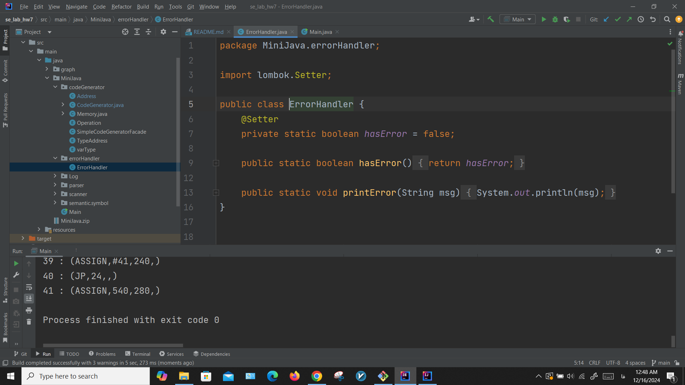
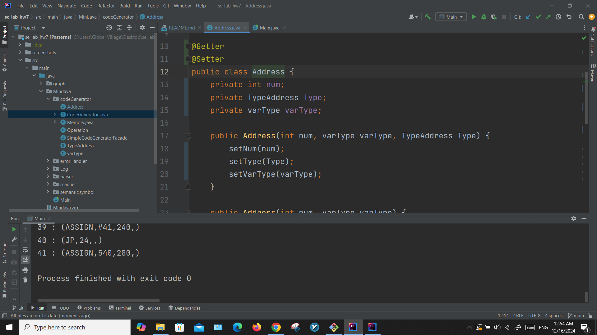
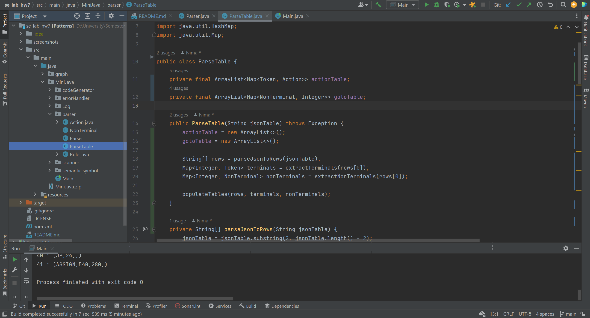
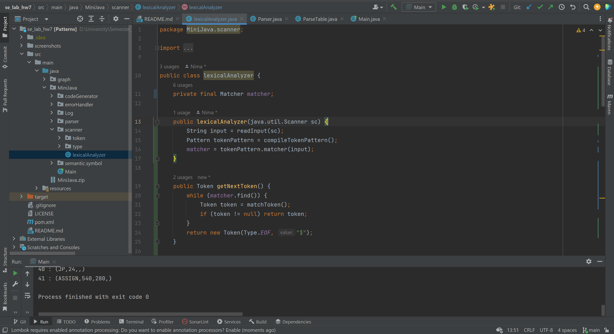

### بخش اول 

# Polymorphism
برای انجام این بازآرایی به فایل codeGenerator.java نگاه می کنیم و مشاهده می کنیم که این فایل از switch case های طولانی تشکیل شده است. برای رفع این مشکل از polymorphism استفاده میکنیم. یک SemanticAction interface تعریف میکنیم که قرار است برای action ها استفاده شود:

این interface یک تابع execute را تعریف میکند که کلاس های بچه باید آن را پیاده سازی کنند. همانطور که در تصویر مشاهده میشود توابع مختلفی که در تابع semanticFunction صدا زده میشدند اکنون باید داخل یک کلاس پیاده شوند که از SemanticAction interface پیروی میکند. با این تغییرات میتوانیم تابع semanticFunction را به صورت زیر تغییر دهیم:

مشاهده میکنیم که سایز کد به نسبت خیلی کمتر شده است. همچنین این پیاده سازی میتواند برای اضافه کردن قوانین جدید به semanticFunction بسیار مفید باشد و سرعت توسعه را افزایش دهد.

# Facade (1)
مشاهده می کنیم که CodeGenerator.java امکانات زیادی فراهم می کند که برای یک کامپایلر کامل مناسب است. اما می توانیم یک Facade اضافه کنیم که امکانات ساده تر و انتزاعی تری به ما می دهد که کد آن را در مثال زیر می بینیم:

در این کد ما تنها دستورات add, sub, jump را در اختیار استفاده کننده قرار می دهیم. این دستورات در تئوری برای پیاده سازی زیرمجموعه بزرگی از دستورات CodeGenerator اصلی کافی هستند (شاید حتی کل آن را نیز در نظر بگیرند! این را اثبات نکردیم.) این یک مثال از فراهم کردن تنها ویژگی های خاصی از دستورات کد اصلی است. 

# Facade (2)
در اینجا طبق کد زیر یک facade از SymbolTable فراهم می کنیم که اندکی انتزاعی تر از کد اصلی است:

این کد ویژگی های سظخ پایین کد را پنهان می کند (و لذا می توان پیاده سازی سطح پایین را با مشکلات کمتری تغییر داد.) دسترسی به klassها و یا دستوراتی مثل setLastType از دست کاربر خارج شده و دستوراتی مثل createClass جای آن را گرفته است. مشابه قسمت قبل این کد نیز یک انتزاع روی کد است که استفاده از آن را ساده تر می کند. 

# Seperate Query From Modifier
مشاهده می کنیم که در کد اصلی صدا زدن تابع printError از ErrorHandler باعث عوض شدن استیت hasError می شود که چون این متغیر بسته به برداشت و نحوه پیاده سازی شخص دیگر می تواند سبب ایجاد side effect های ناخواسته شود. برای این که این اتفاق نیفتد طبق بازآرایی دو منطق را از هم جدا می کنیم:

متناسب با تغییرات در ErrorHandler تغییراتی را در بخش های دیگر اعمال می کنیم تا کد به درستی کار کند.

# Self Encapsulated Field
مشاهده می کنیم که کد Address.java دارای فیلد های ما به صورت public هستند. ابتدا آن ها را به صورت private در آورده و بقیه فایل ها (در اینجا صرفا codeGenerator)‌ تغییر داده تا کد را درست کنیم. در نهایت داخل خود کلاس Address.java توابع را جوری تغییر داده که صرفا از setter/getter ها استفاده کند. به این ترتیب یک بازآرایی Self Encapsulated Field انجام داده ایم.

# Custom 1
پیچیدگی کلاس ParseTable.java را با تعریف کردن توابع دیگر و جداسازی منطق ها بازآرایی می کنیم. با تعریف توابع جدید نه تنها منطق بخش های مختلف کد از بخش public و در دسترس بیرونی جدا شده بلکه تغییر دادن کد نیز کار راحت تری است.

# Custom 2
مشابه قسمت قبلی کد را بازآرایی می کنیم تا خوانش و جداسازی منطق ها به خوبی صورت بگیرد.

# پاسخ سوالات 
1.
کد تمیز: کدی که خواندن، درک و نگهداری از آن آسان است و با وضوح و هدف نوشته شده است.
\
بدهی فنی: هزینه ای که از انتخاب راه حل های سریع به جای طراحی های اصولی انباشته می شود و نیاز به بازنگری در آینده دارد.
\
بوی بد کد: نشانه هایی در کد که مشکلات عمیق تری را نشان می دهند و ممکن است منجر به کاهش خوانایی یا قابلیت نگه داری شوند.

2.
حجم‌دهنده‌ها: اجزای کدی که بیش از حد بزرگ یا پیچیده شده‌اند و درک یا نگهداری از آنها دشوار است (مثل متدهای طولانی یا کلاس‌های بزرگ).
\
سوءاستفاده‌کنندگان شی‌گرایی: استفاده نادرست یا درک اشتباه از اصول برنامه‌نویسی شی‌گرا که به طراحی ضعیف منجر می‌شود (مثل استفاده از switch یا امتناع از ارث‌بری).
\
مانع تغییرات: ساختارهایی در کد که تغییر یک بخش از سیستم را بدون تأثیرگذاری بر سایر بخش‌ها دشوار می‌کنند (مثل تغییرات واگرا یا جراحی پراکنده).
\
بی‌مصرف‌ها: کدهای اضافی یا غیرضروری که می‌توان با اطمینان حذف کرد (مثل کلاس‌های تنبل یا کدهای تکراری).
\
وابستگی‌ها: وابستگی‌های ناسالم بین اجزا که مدولار بودن و انعطاف‌پذیری را کاهش می‌دهند (مثل حسادت ویژگی یا صمیمیت نامناسب).

3.
دسته‌بندی: بی‌مصرف‌ها
\
  ادغام کلاس: اگر عملکرد کلاس تنبل حداقلی است، آن را در یک کلاس دیگر ادغام کنید.
\  
  فروپاشی سلسله‌مراتب: اگر کلاس ارزش کمی اضافه می‌کند، آن را با کلاس والد ترکیب کنید.
\
    اگر انتظار می‌رود که کلاس تنبل در آینده نزدیک عملکرد بیشتری پیدا کند، نگه‌داشتن آن می‌تواند از رفاکتورینگ مجدد در آینده جلوگیری کند.